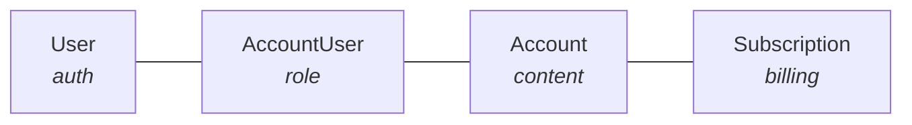

A common mistake in SaaS apps is putting everything on the User model: subscription
status, quotas, assets, preferences. Three problems follow.

- **Sharing becomes impossible.** Subscriptions are locked to one person, so family and
  team plans have nowhere to live.
- **Profile switching breaks.** There is no way to hold separate preferences per context.
- **Billing gets tangled.** Transferring a subscription or handling a corporate account
  means moving rows between users.

Separating authentication (User) from content ownership (Account) from billing
(Subscription) avoids all three.



## The four models

<AccordionGroup>
  <Accordion title="User: authentication identity only" icon="user">
    ```python
    class User(UserMixin, Model):
        email = db.Column(db.String(255), unique=True)  # OAuth identity
        stripe_customer_id = db.Column(db.String(255))  # for the billing portal
        # no subscription_status, no quota, no content here
    ```
  </Accordion>
  <Accordion title="Account: where content and quotas live" icon="folder">
    Projects, documents and assets belong to an Account rather than a User, in the way
    Netflix profiles belong to a household.

    ```python
    class Account(Model):
        name = db.Column(db.String(100))               # "Family", "Work", etc.
        owner_user_id = db.Column(db.ForeignKey("users.id"))
        quota = db.Column(db.Integer, default=0)       # usage limits here
    ```
  </Accordion>
  <Accordion title="AccountUser: many-to-many with roles" icon="users">
    ```python
    class AccountUser(Model):
        user_id = db.Column(db.ForeignKey("users.id"), primary_key=True)
        account_id = db.Column(db.ForeignKey("accounts.id"), primary_key=True)
        role = db.Column(db.String(20))  # "admin", "member", "child"
    ```
  </Accordion>
  <Accordion title="Subscription: billing attached to the Account" icon="credit-card">
    ```python
    class Subscription(Model):
        account_id = db.Column(db.ForeignKey("accounts.id"))
        stripe_subscription_id = db.Column(db.String(255))
        status = db.Column(db.String(50))     # "active", "canceled", etc.
        tier_name = db.Column(db.String(50))  # "Basic", "Pro", "Enterprise"
    ```
  </Accordion>
</AccordionGroup>

## What the split gives you

- One user can reach several accounts, personal and work.
- Several users can share one account, which is how a family plan works.
- Subscriptions transfer cleanly when ownership changes.
- Content queries scope to an Account instead of scattering across Users.
- Team features arrive later without a schema change.

<Note>
  Use this pattern for any app with subscriptions, quotas, shared resources, or where
  users might want separate workspaces or profiles.
</Note>
