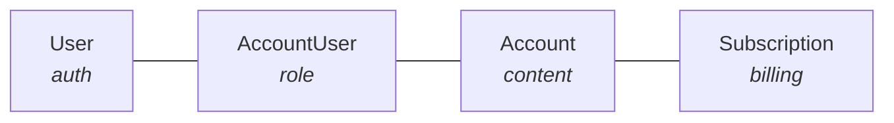

A common mistake when building SaaS apps is putting everything on the User model —
subscription status, quotas, assets, preferences. This creates problems:

- **Family and team sharing become impossible** — subscriptions are locked to one person
- **Profile switching breaks** — you cannot have separate preferences per context
- **Billing gets messy** — transferring subscriptions or handling corporate accounts is hard

The better pattern separates authentication (User) from content ownership (Account) from
billing (Subscription).



## The four models

<AccordionGroup>
  <Accordion title="User — authentication identity only" icon="user">
    ```python
    class User(UserMixin, Model):
        email = db.Column(db.String(255), unique=True)  # OAuth identity
        stripe_customer_id = db.Column(db.String(255))  # for the billing portal
        # NO subscription_status, NO quota, NO content here
    ```
  </Accordion>
  <Accordion title="Account — where content and quotas live" icon="folder">
    Think Netflix profiles. Projects, documents and assets belong to an Account, not a
    User.

    ```python
    class Account(Model):
        name = db.Column(db.String(100))               # "Family", "Work", etc.
        owner_user_id = db.Column(db.ForeignKey("users.id"))
        quota = db.Column(db.Integer, default=0)       # usage limits here
    ```
  </Accordion>
  <Accordion title="AccountUser — many-to-many with roles" icon="users">
    ```python
    class AccountUser(Model):
        user_id = db.Column(db.ForeignKey("users.id"), primary_key=True)
        account_id = db.Column(db.ForeignKey("accounts.id"), primary_key=True)
        role = db.Column(db.String(20))  # "admin", "member", "child"
    ```
  </Accordion>
  <Accordion title="Subscription — billing state attached to the Account" icon="credit-card">
    ```python
    class Subscription(Model):
        account_id = db.Column(db.ForeignKey("accounts.id"))
        stripe_subscription_id = db.Column(db.String(255))
        status = db.Column(db.String(50))     # "active", "canceled", etc.
        tier_name = db.Column(db.String(50))  # "Basic", "Pro", "Enterprise"
    ```
  </Accordion>
</AccordionGroup>

## What this buys you

- One user can access multiple accounts (personal plus work)
- Multiple users can share one account (a family plan)
- Subscriptions transfer cleanly when ownership changes
- Content queries are scoped to Account, not scattered across Users
- Team features can be added later without schema changes

<Note>
  **When to use this pattern:** any app with subscriptions, quotas, shared resources, or
  where users might want separate workspaces or profiles.
</Note>
